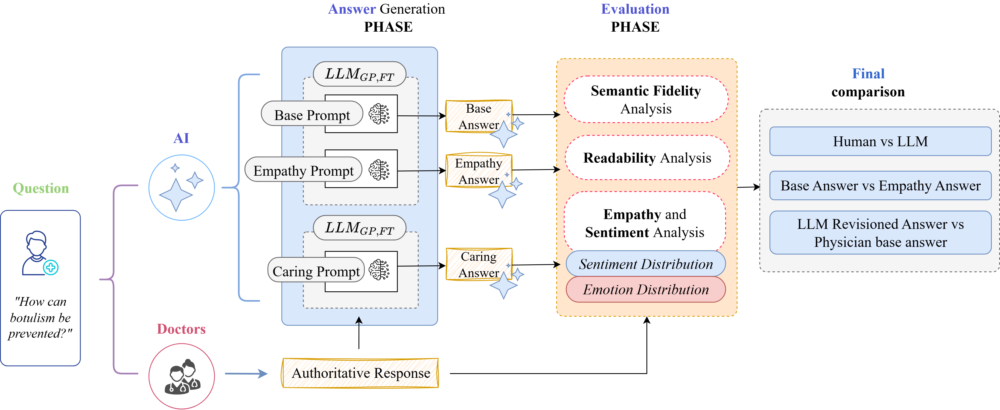

# 🩺🤖  Can "AI" be a Doctor? **A Study of Empathy, Readability, and Alignment in Clinical LLMs**

---

## 🧠 Overview

As Large Language Models (LLMs) are increasingly deployed in patient-facing healthcare settings, their **communicative alignment** with clinical standards — **semantic fidelity**, **readability**, and **affective resonance** — remains insufficiently quantified.
This work conducts a multidimensional evaluation of general-purpose and domain-specialized LLMs across structured medical explanations and real-world consumer-authored consultations, comparing model-generated responses against physician-authored ones and testing whether LLMs can also act as **collaborative editors** of physician answers.

---

## 💡 Research Questions

1. **RQ1 (Empathy):** How do LLMs compare to human physicians in expressing empathy and emotional awareness in clinical communication?
2. **RQ2 (Readability):** Do LLM-generated responses differ from physician-authored answers in linguistic readability?
3. **RQ3 (Prompt-based Alignment):** Does empathy-oriented prompting improve emotional tone and readability while preserving semantic fidelity?
4. **RQ4 (Human–AI Collaboration):** Can LLMs improve the clarity and emotional appropriateness of physician-authored responses through collaborative rewriting?
5. **RQ5 (Expert–Patient Value Alignment):** To what extent do different LLM configurations satisfy the distinct preferences expressed by medical experts and patients?

---

## 🏗️ Methodology

The framework assesses three core communicative dimensions:

| Dimension           | Metric(s)                                                                 |
|----------------------|----------------------------------------------------------------------------|
| Semantic Fidelity    | Cosine similarity (BioBERT-mnli-snli-scinli-scitail-mednli-stsb encoder)  |
| Readability          | Flesch–Kincaid Grade Level (FKGL), Gunning Fog Index (GFI)                |
| Affective Resonance  | Sentiment classification (5-class) + fine-grained emotion classification (28 categories) |

Three response conditions are compared against the physician reference:
- **Base Prompt**: standard, formal medical tone (autonomous generation)
- **Empathy Prompt**: empathy-oriented, accessibility-focused prompting (autonomous generation)
- **Rephrase Prompt**: LLM-based collaborative rewriting of the physician's own answer

The pipeline supports both autonomous generation and collaborative revision of expert-authored responses, enabling evaluation of LLMs as both independent communicators and editing assistants. An independent **LLM-as-judge** evaluation (Qwen3-32B, scoring factual accuracy, completeness, and coherence) and a dedicated **prompt-sensitivity ablation** complement the main analysis.



---

## 📊 Key Findings

- Every baseline LLM (Mixtral, MedGemma, GPT-5, Claude Sonnet 4.5) is **significantly more complex** than physician-authored text on both datasets (complexity order: Mixtral < MedGemma < GPT < Claude); Claude_Base reaches up to ~2× the physician FKGL.
- **Empathy** and **Rephrase** prompting substantially reduce linguistic complexity, frequently pushing output **to or below** physician-level readability (all p < 0.001).
- Both strategies **overshoot** physician-level *caring* emotion (up to 6–20× the physician baseline on MedQuAD), rather than simply matching it — a systematic overcorrection.
- Empathy prompting's effect on sentiment alignment is **inconsistent and architecture-dependent**: it lowers Very Negative sentiment everywhere, but for Claude it can shift sentiment *further* from the physician distribution.
- **Rephrase** configurations achieve the **highest semantic fidelity** to physician answers on both datasets (best: Gemini_Rephrase, µ up to 0.92), confirmed independently by the LLM-as-judge evaluation.
- No LLM configuration surpasses physicians on expert-rated **Accuracy** or **Precision**; the sole exception is **Style** on MedRedQA, where every Rephrase configuration matches or exceeds the physician's own expert score.
- Patients consistently prefer rewritten (Rephrase) variants for trust, comprehensibility, and emotional tone.
- A prompt-sensitivity ablation confirms these effects reflect genuine properties of the Empathy/Rephrase strategies, not artifacts of specific prompt wording (readability results show some model-dependent sensitivity, mainly for Mixtral).

---

## 🧪 Datasets

- **[MedQuAD](https://huggingface.co/datasets/keivalya/MedQuad-MedicalQnADataset)**: 47,457 QA pairs from 12 authoritative NIH sources (MedlinePlus, cancer.gov, niddk.nih.gov). A category-stratified, readability-driven subset of **231 representative questions** (16 question types) is used for cross-architecture evaluation.
- **MedRedQA**: ~51,000 consumer question / verified-expert-answer pairs sourced from the r/AskDocs subreddit (2013–2022). A linguistically clustered subset of **200 representative samples** is used, selected from genuine long-form physician answers.

---

## 🤖 Models & Prompts

| Variant                  | Description                                              |
|---------------------------|-----------------------------------------------------------|
| `Mixtral_Base`             | Mixtral + Base Prompt                                    |
| `MedGemma_Base`            | MedGemma (Gemma 3, medically fine-tuned) + Base Prompt    |
| `GPT_Base`                 | GPT-5 + Base Prompt                                       |
| `Claude_Base`               | Claude Sonnet 4.5 + Base Prompt                            |
| `*_Empathy`                | Same models + Empathy Prompt                              |
| `*_Rephrase`               | Same models rewriting the physician's own answer          |
| `Gemini_Rephrase`          | Gemini 2.5 Pro (Rephrase condition only — frequently declined to answer without sufficient clinical context in Base/Empathy conditions) |

📎 Full prompt templates are provided in Appendix A of the paper.

---

## 👥 Human & LLM Evaluation

- 🤖 **LLM-as-Judge** (Qwen3-32B, independent of all evaluated systems) → factual accuracy, completeness, coherence
- 🩺 **Expert Evaluation**: a single board-certified cardiologist → clinical accuracy, stylistic appropriateness, linguistic precision
- 🧑‍⚕️ **Patient Evaluation** (panel of 10 lay raters) → trust, comprehensibility, emotional tone

**Highest semantic fidelity overall**: `Gemini_Rephrase`
**Most readable**: `Empathy`/`Rephrase` configurations (consistently at or below physician-level FKGL/GFI)
**Best relational alignment (patients)**: `Rephrase` configurations
**No epistemic superiority over physicians**, except Style on MedRedQA under Rephrase

---

## 📁 Repository Structure

```

CanAIBeADoctor/
│
├── data/              # MedQuAD and MedRedQA processed subsets
├── analysis/          # Evaluation scripts (semantic fidelity, readability, sentiment, emotion, LLM-as-judge)
├── results/           # Figures, tables, evaluation metrics
└── README.md          # This file

```
---

We welcome contributions to improve our work! To contribute, simply open a pull request or report issues on our [issue tracker](https://github.com/PRAISELab-PicusLab/CanAIBeADoctor/issues). We look forward to your improvements!

👨‍💻 This project was developed by Mariano Barone, Francesco Di Serio, Roberto Moio, Marco Postiglione, Giuseppe Riccio, Antonio Romano, and Vincenzo Moscato at *University of Naples Federico II* (with Northwestern University and University of Campania "Luigi Vanvitelli") – [PRAISE Lab - PICUS](https://github.com/PRAISELab-PicusLab/)

---

## 🧭 License & Acknowledgments

This work is licensed under a
[Creative Commons Attribution-NonCommercial 4.0 International License](https://creativecommons.org/licenses/by-nc/4.0/).

[](https://creativecommons.org/licenses/by-nc/4.0/)

---
